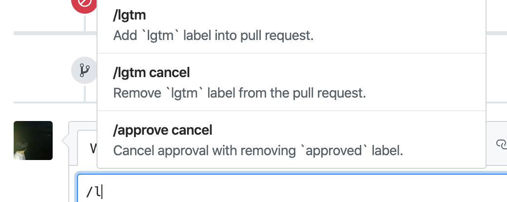

# github-comment-suggest

Enable comment suggestion on GitHub's comment form.



## Usage

Set suggestion list at Extension options pages.

_Example_

```json
[
  {
    "name": "/command",
    "description": "This command is awesome."
  }
]
```
